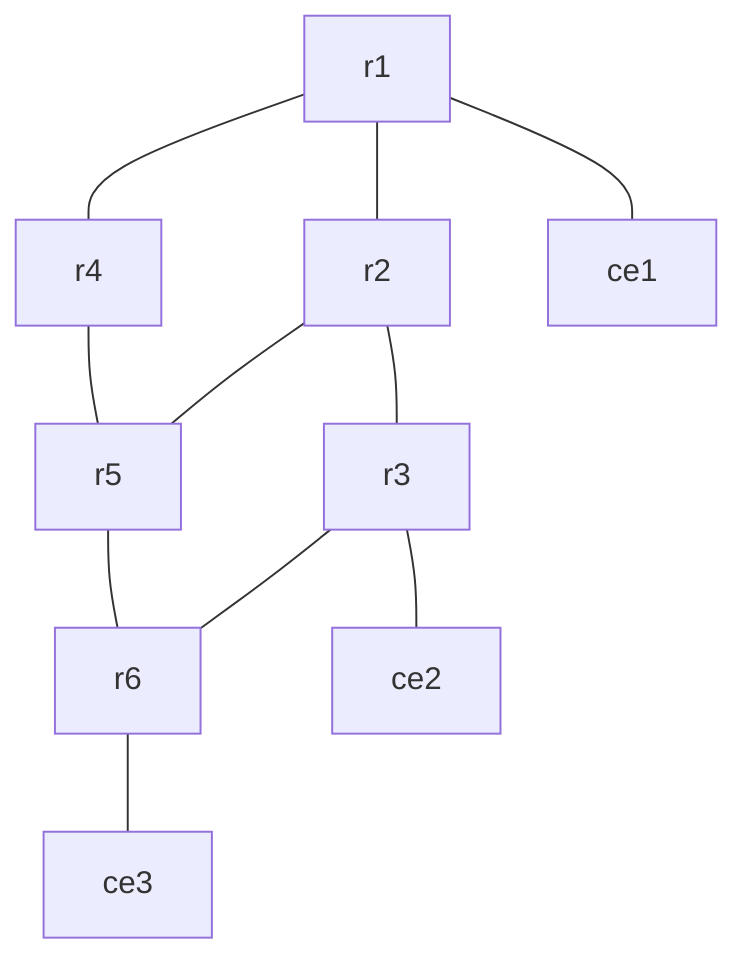
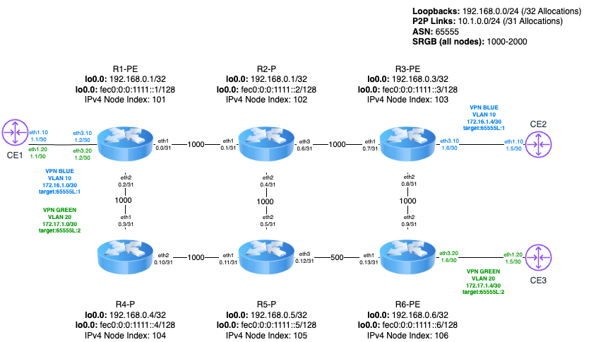

# clab-crpd-segment-routing

## Overview

A Segment Routing MPLS (SR-MPLS) Service Provider (SP) network using [CONTAINERlab](https://containerlab.dev/) and [cRPD](https://www.juniper.net/documentation/us/en/software/crpd/crpd-deployment/topics/concept/understanding-crpd.html) nodes to enable MPLS Layer 3 VPN (MPLS L3VPN) connectivity between Customer Edge (CE) devices

## Requirements

- [CONTAINERlab](https://containerlab.dev/install/)
  - _The [CONTAINERlab](https://containerlab.dev/install/) installation guide outlines various installation methods. This lab assumes all [pre-requisites](https://containerlab.dev/install/#pre-requisites) (including Docker) are met and CONTAINERlab is installed via the [install script](https://containerlab.dev/install/#install-script)._
- Docker cRPD [image](https://www.juniper.net/documentation/us/en/software/crpd/crpd-deployment/topics/task/crpd-linux-server-install.html#id-loading-the-crr-image) >= 22.4R1-S2.1
  - Adjust the ```topology.kinds.crpd.image``` value in [setup.yml](setup.yml) to reflect the proper image and tag

  ```shell
  $ docker image ls | grep crpd
  crpd                       22.4R1-S2.1    9ed0a701769a   14 months ago   546MB
  ```

- A valid Juniper cRPD license key placed in a file called ```junos.lic``` at the root of the repository (same level as [setup.yml](setup.yml)).
  - **_NOTE: The features required by this lab will not function without a valid license installed on the cRPD nodes and therefore the Makefile will exit before even proceeding with setup if one is not detected. You can obtain a free evaluation license from [here](https://www.juniper.net/us/en/dm/crpd-free-trial.html)_**
- Python 3

## Topology





## Network Resources

- The IPv4 loopback addresses of nodes R1 to R9 are of the following form:
  - 192.168.0.x/32 for router Rx–for example, 192.168.0.1 for R1, and so on.
- The interface addresses are of the following form:
  - 10.1.y.z/31 –the value of y.z is shown next to each link on each router
- All Routers are part of ASN 65555
- Nodes R1 to R6 are all in ISIS Level 2. Within the ISIS topology, the metric of each link is 1000, except the link between R5 and R6, which is 500 in each direction.
- Family MPLS is configured on all core interfaces.
- Two MPLS L3VPN's, BLUE and GREEN, are configured between CE1, CE2, and CE3, as depicted in the diagram
- BGP is configured amongst the PE's (R1, R3, and R6) with relevant address families

### Management network

The following IP addresses are assigned to the containerLAB nodes for management:

| Scope           | Network       | Assignment     | Name   |
| ----------------| ------------- | -------------  | ------ |
| Management      | 10.0.0.0/24   | 10.0.0.2/24    | r1     |
| Management      | 10.0.0.0/24   | 10.0.0.3/24    | r2     |
| Management      | 10.0.0.0/24   | 10.0.0.4/24    | r3     |
| Management      | 10.0.0.0/24   | 10.0.0.5/24    | r4     |
| Management      | 10.0.0.0/24   | 10.0.0.6/24    | r5     |
| Management      | 10.0.0.0/24   | 10.0.0.7/24    | r6     |

## Deployment

Clone this repsoitory and start the lab

```shell
git clone https://github.com/dbono711/clab-crpd-segment-routing.git
cd clab-crpd-segment-routing
make all
```

**_NOTE: CONTAINERlab requires SUDO privileges in order to execute_**

**_NOTE: As indicated in [Requirements](#requirements), a valid Juniper license file named ```junos.lic``` is required_**

- Initializes the ```setup.log``` file
- Creates the [CONTAINERlab network](setup.yml) based on the [topology definition](https://containerlab.dev/manual/topo-def-file/)
  - Apply's the ```config``` file from the respective router folders on each cRPD node
    - This configuration is only meant to bootstrap the root authentication password and enable SSH
- Apply's the cRPD license on each cRPD node
- Loops through each client to execute the configuration SHELL scripts within the [clients](clients) folder
  - The script configures the clients Ethernet/VLAN interface connected to the provider edge devices in the topology (r1,r3,r6)
- Executes an Ansible playbook for configuring the IGP, Segment Routing, and MPLS L3VPN on each cRPD node

## Accessing the container SHELL

The container SHELL can be accessed by using the ```docker exec``` command, as follows:

```docker exec -it <container> bash```

For example, to access the SHELL on the ```r1``` cRPD container

```shell
$ docker exec -it clab-crpd-segment-routing-r1 bash
bash-5.1#
```

## Accessing the JUNOS CLI (via Docker)

The JUNOS CLI can be accessed by using the ```docker exec``` command, as follows:

```docker exec -it <container> cli```

For example, to access the JUNOS CLI via Docker on the ```r1``` cRPD container

```shell
$ docker exec -it clab-crpd-segment-routing-r1 cli
bash-5.1#
```

## Accessing the JUNOS CLI (via SSH)

Each cRPD node also has an SSH port mapped in the [topology](setup.yml). In fact, this is how Ansible communicates with the cRPD nodes to configure them as part of the ```configure``` target in the [Makefile](Makefile).

**Username:** root
**Password:** clab123

For example, to access the JUNOS CLI via SSH on the ```r1``` cRPD container

```shell
$ ssh -p 10022 root@10.0.0.2
bash-5.1#
```

## Capturing packets

Here is an example on how to capture packets directly on the host which CONTAINERlab is running

```sudo ip netns exec clab-crpd-segment-routing-r1 tcpdump -nni eth1```

Here is an example on how to capture packets from a remote host, to the host which CONTAINERlab is running (Note that this example is piping directly to Wireshark which in my case is running on my MAC OS X host)

```ssh [ containerlab host ] "sudo -S ip netns exec [ containerlab container name ] tcpdump -nni eth1 -w -" | /Applications/Wireshark.app/Contents/MacOS/Wireshark -k -i -```

## Cleanup

Stop the lab, tear down the CONTAINERlab containers

```shell
make clean
```

## Logging

All activity is logged to a file called ```setup.log``` at the root of the repository.

## Authors

- Darren Bono - [darren.bono@att.net](mailto://darren.bono@att.net)

## License

This project is licensed under the MIT License. See [LICENSE](LICENSE) for details
